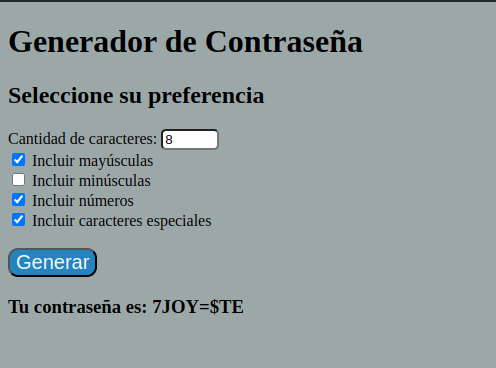

# Generador de Contraseñas

Este proyecto es un generador de contraseñas que permite al usuario personalizar varios aspectos de la contraseña generada, como la longitud y los tipos de caracteres incluidos (mayúsculas, minúsculas, números y símbolos).

## Funcionalidades

El generador de contraseñas ofrece las siguientes funcionalidades:

- **Personalización de la Longitud:** Permite al usuario seleccionar la cantidad de caracteres que desea que tenga la contraseña.
- **Inclusión de Caracteres:** El usuario puede elegir incluir mayúsculas, minúsculas, números y/o símbolos en la contraseña generada.
- **Generación de Contraseña Aleatoria:** Al hacer clic en el botón "Generar contraseña", se genera una contraseña aleatoria según las preferencias especificadas.

## Tecnologías Utilizadas

El proyecto está desarrollado utilizando las siguientes tecnologías:

- **HTML:** Para la estructura básica de la interfaz de usuario y los controles de entrada.
- **CSS:** Estilos para mejorar la apariencia y usabilidad de la interfaz.
- **JavaScript:** Implementación de la lógica para generar contraseñas aleatorias basadas en las preferencias del usuario.

## Uso

Para utilizar el generador de contraseñas, simplemente abre el archivo `index.html` en tu navegador web. Luego, sigue las instrucciones en pantalla para personalizar la longitud y los tipos de caracteres que deseas incluir en tu contraseña. Finalmente, haz clic en el botón "Generar contraseña" para obtener tu contraseña aleatoria.
